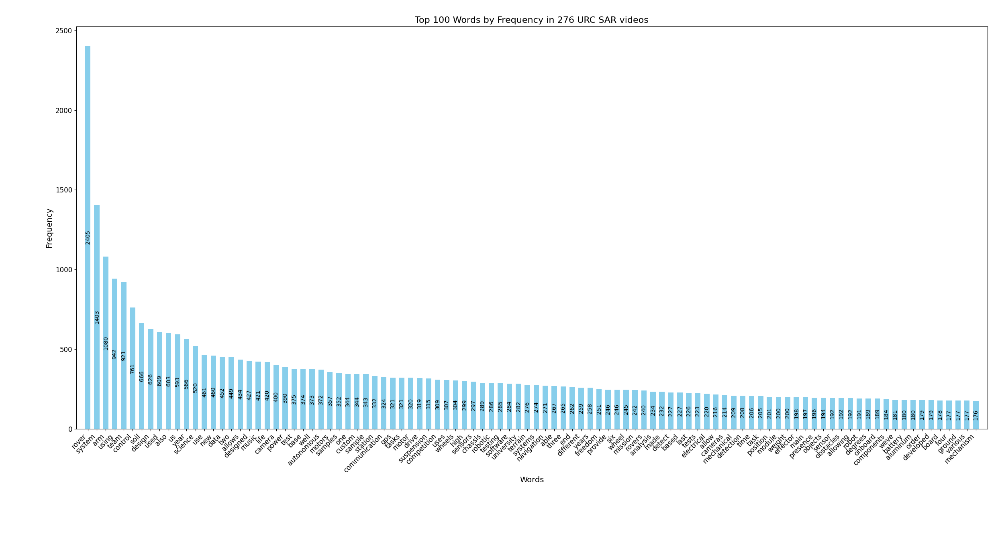

# Here are the 100 mort frequently used words in URC SAR videos:



Feel free to use or modify the code to generate more graphs!

# urc_sar_video_parsing

This package provides scripts for analyzing and visualizing the frequency of words in the transcripts of YouTube videos in the URC SAR videos. The analysis focuses on removing common English stopwords and certain parts of speech to provide a more meaningful representation of the content.

## Installation

Make sure you have Python installed. Then, install the package and its dependencies using:

```bash
pip install .
```

This will install your package in editable mode along with the required dependencies.

## Usage
### Generate Transcript Text Files
To generate transcript text files from YouTube videos, use the following command:

```bash
generate_txt_files
```

This script downloads YouTube video transcripts given a playlist URL.

### Analyze Transcripts

To analyze and visualize word frequencies in the generated transcript text files, use the following command:

```bash
generate_transcript_data
```

This script performs analysis on YouTube video transcripts, focusing on removing stopwords and certain parts of speech.

Adjust parameters in the scripts or refer to the script files for additional customization options.

## Requirements 

The package relies on the following dependencies:

- matplotlib
- nltk
- youtube_transcript_api
- youtube_dl

These dependencies will be automatically installed during the package installation process.

## License  

This project is licensed under the MIT License - see the [LICENSE](LICENSE) file for details.
